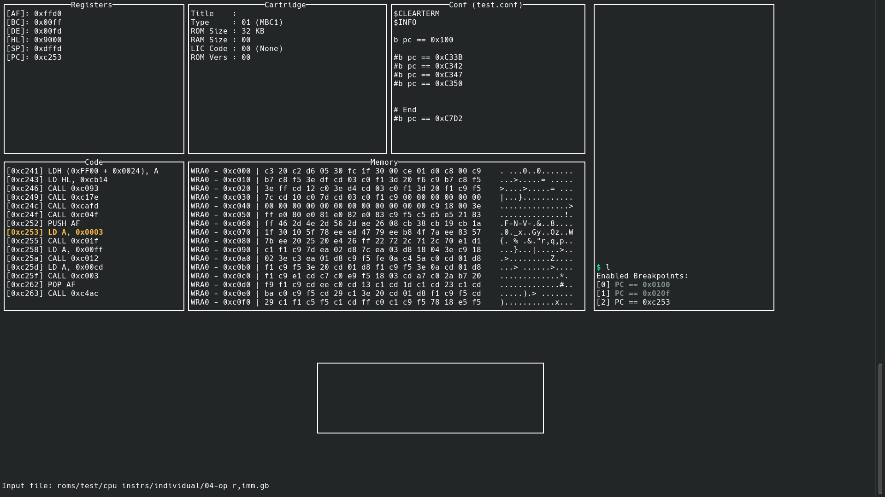

# RGE - Rui's Gameboy Emulator

A Gameboy Color emulator, under development.
Includes a full TUI debugger.

Graphics are not yet implemented but I will be using SDL2 for game graphics and sound.

Check the progress on [tests](testing.md).

## Table of contents
1. [Using](#Using)
2. [Key controls](#Key-controls)
3. [Documentation](#Documentation)
4. [Screenshots](#Screenshots)
5. [References](#References)

## Using

Only tested in a Linux system with the terminal emulator Konsole.
To test, clone the repository and run

```bash
make
```

Find a ROM and run it with

```bash
./gameboy PATH_TO_ROM
```

## Key controls

| Keys | Behaviour |
| :--: | :-- |
| CTRL+X    | Close the program |
| SPACEBAR  | Perform one step on the CPU |
| N         | Perform one step on the CPU and jump over CALL |
| CTRL+R    | Refresh the code representation from memory |
| :         | Enter command entering mode / ESC to exit |
| ARROW_UP  | Go back  one memory page on the display |
| ARROW_DOWN  | Go to the next memory page on the display |


## Documentation

To build the documentation

```bash
make doc
```
Then, open doc/html/index.html with your prefered internet browser.

### Open with the Firefox Browser
```bash
./docs.sh
```

## Screenshots



## References

[F14_GameboyColor.pdf](reference/F14_GameboyColor.pdf)
[Game Box Programming Manual.pdf](reference/Game-Box-Programming-Manual.pdf)
[gbctr.pdf](gbctr.pdf)

https://github.com/rockytriton/LLD_gbemu

https://www.pastraiser.com/cpu/gameboy/gameboy_opcodes.html

https://gbdev.io/pandocs/
